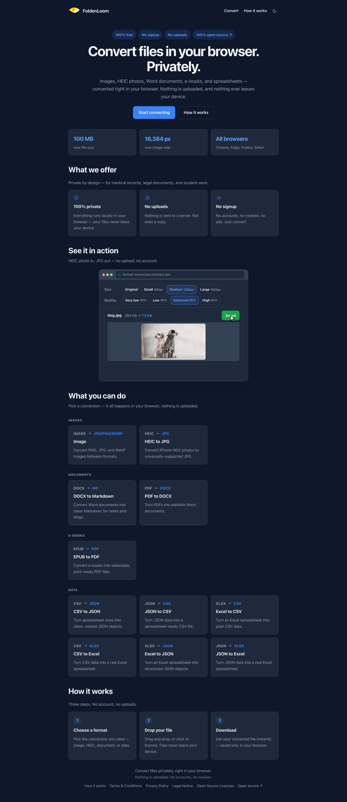
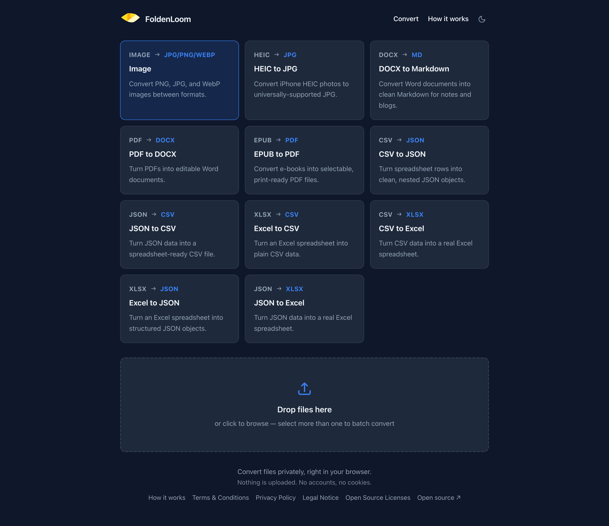

# Format Converter

Convert files right in your browser — nothing gets uploaded.

No ads, no watermarks, no "enter your email" step. The file stays on your computer the whole
time, so it's safe even for private documents like medical or legal records.

This project is open source (MIT). See [LICENSE](LICENSE).

## Screenshots

### Landing page
Hero, specs strip, and the interactive HEIC → JPG demo.



### Conversion tool
The converter with the format picker and drop zone.



## Specs & requirements

- **File size**: up to 100 MB per file.
- **Image size**: up to 16,384 px on the longest side.
- **Browsers**: the latest versions of Chrome, Edge, Firefox, and Safari (desktop and mobile).
  HEIC conversion uses WebAssembly, which all of these support.
- **Privacy**: everything runs locally — see [Your data stays on your device](#your-data-stays-on-your-device).

## What it can do

| Convert | To | Why you'd use it |
| --- | --- | --- |
| Image (PNG / JPG / WebP) | JPG / PNG / WebP | Convert, resize, and compress images between formats |
| HEIC / HEIF | JPG | iPhone photos that won't open on Windows or older apps |
| DOCX | Markdown | Turn a Word document into clean text for notes, blogs, or wikis |
| PDF | DOCX | Edit a PDF's text in Word instead of retyping it |
| EPUB | PDF | Read or print an e-book in a format that works everywhere |
| XLSX / XLS | CSV / JSON | Get spreadsheet data into plain text developers and tools can use |
| CSV / JSON | XLSX | Open CSV or JSON data in Excel or Google Sheets |

The heavy lifting is done by open-source libraries —
[libheif-js](https://github.com/catdad-experiments/libheif-js),
[mammoth](https://github.com/mwilliamson/mammoth.js),
[turndown](https://github.com/mixmark-io/turndown),
[pdf-lib](https://github.com/Hopding/pdf-lib),
[pdf.js](https://github.com/mozilla/pdf.js),
[SheetJS](https://github.com/SheetJS/sheetjs),
[papaparse](https://github.com/mholt/PapaParse),
[htmlparser2](https://github.com/fb55/htmlparser2),
[fflate](https://github.com/101arrowz/fflate) —
but you don't need to know any of that to use the site.

## Your data stays on your device

- Files are read and converted locally in your browser.
- Nothing is sent to a server.
- Only cookieless, aggregate Cloudflare Web Analytics for anonymous page-view counts.

## Try it

The site is live at https://format-conversion.maidemikkegert.workers.dev.

To run it locally:

```bash
npm install
npm run dev
```

Then open the URL it prints (usually http://localhost:5173/).

## For developers

The site is deployed to Cloudflare Workers (static assets) via Workers Builds — every push to
`main` rebuilds and redeploys automatically. Build output is configured in `wrangler.jsonc`,
and security headers live in `public/_headers`.

## Roadmap

- More conversions (e.g. ODT, ODS, and other formats)
